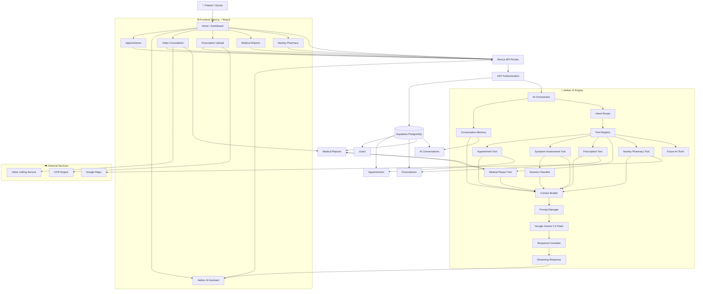

# 🏥 MediCare – AI-Powered Healthcare Management Platform

> An AI-first healthcare platform that combines appointment management, intelligent medical assistance, and personalized health insights through a modular AI architecture.

🌐 **Live Demo:** https://medi-care-2vbm.vercel.app/

---

## ✨ Features

### 🤖 Aether AI Assistant
AI-powered healthcare assistant with contextual conversations, symptom analysis, emergency detection, personalized guidance, and real-time streaming responses powered by **Google Gemini 2.5 Flash**.

### 📅 Smart Appointment Management
Book, manage, and track appointments with doctors, including upcoming visits, appointment history, and AI-assisted scheduling context.

### 💊 Prescription Management
Upload and digitize prescriptions using AI-powered OCR, automatically extract medications, and securely maintain prescription history.

### 📹 Video Consultation
Connect with doctors through secure, real-time video consultations for seamless virtual healthcare.

### 📝 AI Consultation Reports
Automatically generate structured consultation summaries after video calls, including diagnosis, prescribed medicines, and follow-up recommendations.

### 🩺 Symptom Assessment
Describe symptoms in natural language and receive AI-powered severity assessment, self-care guidance, OTC suggestions, and recommendations on when to seek medical attention.

### 📍 Nearby Pharmacy Finder
Discover nearby pharmacies with location-aware recommendations and quick access to medicine availability.

### 🔒 Secure Authentication
JWT-based authentication with protected routes, secure session management, and user-specific access to healthcare records.

---

# 🏗️ AI Architecture

```text
                         User
                           │
                           ▼
                  Next.js Frontend
                           │
                           ▼
                    API Route Layer
                           │
                           ▼
                  Authentication Layer
                           │
                           ▼
                    AI Orchestrator
                           │
        ┌──────────────────┼──────────────────┐
        │                  │                  │
        ▼                  ▼                  ▼
  Intent Router      Tool Registry      Conversation Memory
                           │
        ┌──────────────────┼──────────────────┐
        │                  │                  │
        ▼                  ▼                  ▼
 Appointment Tool   Symptom Tool     (Future AI Tools)
        │                  │
        ▼                  ▼
Appointment      Severity Classifier
Context Service         │
        └───────────────┬───────────────┐
                        ▼
                 Context Builder
                        │
                        ▼
                 Prompt Manager
                        │
                        ▼
            Google Gemini 2.5 Flash
                        │
                        ▼
              Response Formatter
                        │
                        ▼
              Streaming Response
                        │
                        ▼
                   Frontend UI
```

---

# 🧠 AI Request Flow

```text
User Query
    │
    ▼
Authentication
    │
    ▼
Intent Detection
    │
    ▼
Relevant AI Tool
    │
    ▼
Context Extraction
    │
    ▼
Context Builder
    │
    ▼
Prompt Manager
    │
    ▼
Gemini 2.5 Flash
    │
    ▼
Formatted Response
    │
    ▼
Streaming to UI
```

---

# 🛠️ Tech Stack

### Frontend
- Next.js 16
- React 19
- TypeScript
- Tailwind CSS
- shadcn/ui

### Backend
- Next.js API Routes
- Prisma ORM
- PostgreSQL (Supabase)
- JWT Authentication

### AI Stack
- Google Gemini 2.5 Flash
- AI Orchestrator
- Intent Router
- Tool Registry
- Context Builder
- Prompt Manager
- Response Formatter

### Deployment
- Vercel
- Supabase

---

# 🚀 Getting Started

```bash
git clone <repository-url>
cd medicare

npm install

npx prisma generate
npx prisma db push

npm run dev
```

Create a `.env` file:

```env
DATABASE_URL=
DIRECT_URL=
JWT_SECRET=
GEMINI_API_KEY=
NEXT_PUBLIC_SUPABASE_URL=
NEXT_PUBLIC_SUPABASE_ANON_KEY=
```

---

# 📂 Current AI Modules

| Module | Status |
|---------|--------|
| Authentication | ✅ |
| AI Orchestrator | ✅ |
| Intent Router | ✅ |
| Tool Registry | ✅ |
| Context Builder | ✅ |
| Prompt Manager | ✅ |
| Gemini Integration | ✅ |
| Appointment Intelligence | ✅ |
| Symptom Assessment | ✅ |
| Severity Classifier | ✅ |
| Conversation Memory | ✅ |
| Streaming Responses | ✅ |

---

# 🚧 Roadmap

- ✅ Appointment Intelligence
- ✅ Symptom Assessment
- 🔄 Prescription Intelligence
- 🔄 Medical Report Intelligence
- 🔄 Health Summary
- 🔄 Timeline Intelligence
- 🔄 Multi-tool AI Reasoning
- 🔄 Dark Mode
- 🔄 Docker Support

---
## 🏗️ MediCare End-to-End Architecture


## 👨‍💻 Author

**Ayush Carpenter**

If you found this project helpful, consider giving it a ⭐ on GitHub!

[Recording 2026-07-06 124619.zip](https://github.com/user-attachments/files/29691558/Recording.2026-07-06.124619.zip)

