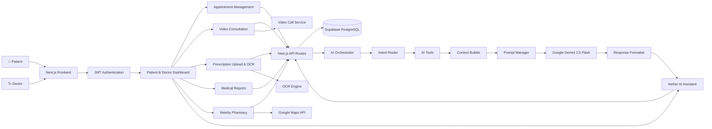

# 🏥 MediCare – AI-Powered Healthcare Management Platform

> An AI-first healthcare platform that combines appointment management, intelligent medical assistance, and personalized health insights through a modular AI architecture.

🌐 **Live Demo:** https://medi-care-2vbm.vercel.app/

---

## ✨ Features

### 🤖 Aether AI Assistant
AI-powered healthcare assistant with contextual conversations, symptom analysis, emergency detection, personalized guidance, and real-time streaming responses powered by **Google Gemini 2.5 Flash**.

### 📅 Smart Appointment Management
Book, manage, and track appointments with doctors, including upcoming visits, appointment history, and AI-assisted scheduling context.

### 💊 Prescription Management
Upload and digitize prescriptions using AI-powered OCR, automatically extract medications, and securely maintain prescription history.

### 📹 Video Consultation
Connect with doctors through secure, real-time video consultations for seamless virtual healthcare.

### 📝 AI Consultation Reports
Automatically generate structured consultation summaries after video calls, including diagnosis, prescribed medicines, and follow-up recommendations.

### 🩺 Symptom Assessment
Describe symptoms in natural language and receive AI-powered severity assessment, self-care guidance, OTC suggestions, and recommendations on when to seek medical attention.

### 📍 Nearby Pharmacy Finder
Discover nearby pharmacies with location-aware recommendations and quick access to medicine availability.

### 🔒 Secure Authentication
JWT-based authentication with protected routes, secure session management, and user-specific access to healthcare records.

---

# 🏗️ AI Architecture

```text
                         User
                           │
                           ▼
                  Next.js Frontend
                           │
                           ▼
                    API Route Layer
                           │
                           ▼
                  Authentication Layer
                           │
                           ▼
                    AI Orchestrator
                           │
        ┌──────────────────┼──────────────────┐
        │                  │                  │
        ▼                  ▼                  ▼
  Intent Router      Tool Registry      Conversation Memory
                           │
        ┌──────────────────┼──────────────────┐
        │                  │                  │
        ▼                  ▼                  ▼
 Appointment Tool   Symptom Tool     (Future AI Tools)
        │                  │
        ▼                  ▼
Appointment      Severity Classifier
Context Service         │
        └───────────────┬───────────────┐
                        ▼
                 Context Builder
                        │
                        ▼
                 Prompt Manager
                        │
                        ▼
            Google Gemini 2.5 Flash
                        │
                        ▼
              Response Formatter
                        │
                        ▼
              Streaming Response
                        │
                        ▼
                   Frontend UI
```

---

# 🧠 AI Request Flow

```text
User Query
    │
    ▼
Authentication
    │
    ▼
Intent Detection
    │
    ▼
Relevant AI Tool
    │
    ▼
Context Extraction
    │
    ▼
Context Builder
    │
    ▼
Prompt Manager
    │
    ▼
Gemini 2.5 Flash
    │
    ▼
Formatted Response
    │
    ▼
Streaming to UI
```

---

# 🛠️ Tech Stack

### Frontend
- Next.js 16
- React 19
- TypeScript
- Tailwind CSS
- shadcn/ui

### Backend
- Next.js API Routes
- Prisma ORM
- PostgreSQL (Supabase)
- JWT Authentication

### AI Stack
- Google Gemini 2.5 Flash
- AI Orchestrator
- Intent Router
- Tool Registry
- Context Builder
- Prompt Manager
- Response Formatter

### Deployment
- Vercel
- Supabase
- Docker

---

# 🚀 Getting Started

```bash
git clone <repository-url>
cd medicare

npm install

npx prisma generate
npx prisma db push

npm run dev
```

Create a `.env` file (see [`.env.example`](./.env.example) for a ready-to-copy template):

```env
# Database (Supabase PostgreSQL)
DATABASE_URL=
DIRECT_URL=

# Authentication
JWT_SECRET=

# AI
GEMINI_API_KEY=

# Image storage (profile photos, prescription uploads)
CLOUDINARY_CLOUD_NAME=
CLOUDINARY_API_KEY=
CLOUDINARY_API_SECRET=

# Nearby pharmacy search
SERPAPI_KEY=

# Seeded admin login
ADMIN_EMAIL=
ADMIN_PASSWORD=
```

---

# 🐳 Running with Docker

The app also ships with a multi-stage `Dockerfile` and a `docker-compose.yml` that runs
it alongside its own local PostgreSQL container — no Supabase account needed to try it.

```bash
# 1. Copy the env template and fill in at least JWT_SECRET, GEMINI_API_KEY, ADMIN_PASSWORD
cp .env.example .env

# 2. Build and start both containers
docker compose up --build
```

On first boot, the `app` container automatically runs `prisma db push` against the
bundled Postgres before starting Next.js, so the schema is ready with no manual step.
Visit **http://localhost:3000**.

```bash
docker compose down        # stop the stack
docker compose down -v     # stop and also wipe the local database volume
docker compose logs -f app # tail app logs
```

**Notes:**
- `DATABASE_URL`/`DIRECT_URL` are set inside `docker-compose.yml` to point at the
  bundled `postgres` service — values in your `.env` for those two are ignored by
  Docker Compose on purpose, so this stack can never accidentally touch a real
  Supabase database.
- `CLOUDINARY_*` and `SERPAPI_KEY` are optional for basic local testing (profile-photo
  upload, prescription upload, and the pharmacy finder simply won't work without them).
- The auto `prisma db push` on boot only runs because `docker-compose.yml` sets
  `RUN_DB_PUSH=true` — it's off by default in the raw `Dockerfile`, so pointing the
  image at an external database elsewhere never silently changes its schema.

---

# 📂 Current AI Modules

| Module | Status |
|---------|--------|
| Authentication | ✅ |
| AI Orchestrator | ✅ |
| Intent Router | ✅ |
| Tool Registry | ✅ |
| Context Builder | ✅ |
| Prompt Manager | ✅ |
| Gemini Integration | ✅ |
| Appointment Intelligence | ✅ |
| Symptom Assessment | ✅ |
| Severity Classifier | ✅ |
| Conversation Memory | ✅ |
| Streaming Responses | ✅ |

---

# 🚧 Roadmap

- ✅ Appointment Intelligence
- ✅ Symptom Assessment
- ✅ Docker Support
- 🔄 Prescription Intelligence
- 🔄 Medical Report Intelligence
- 🔄 Health Summary
- 🔄 Timeline Intelligence
- 🔄 Multi-tool AI Reasoning
- 🔄 Dark Mode

---
## 🏗️ MediCare System Architecture



---

> 📘 For the complete technical deep-dive, see [PROJECT_DOCUMENTATION.md](./PROJECT_DOCUMENTATION.md)

## 👨‍💻 Author

**Ayush Carpenter**

If you found this project helpful, consider giving it a ⭐ on GitHub!

[Recording 2026-07-06 124619.zip](https://github.com/user-attachments/files/29691558/Recording.2026-07-06.124619.zip)
